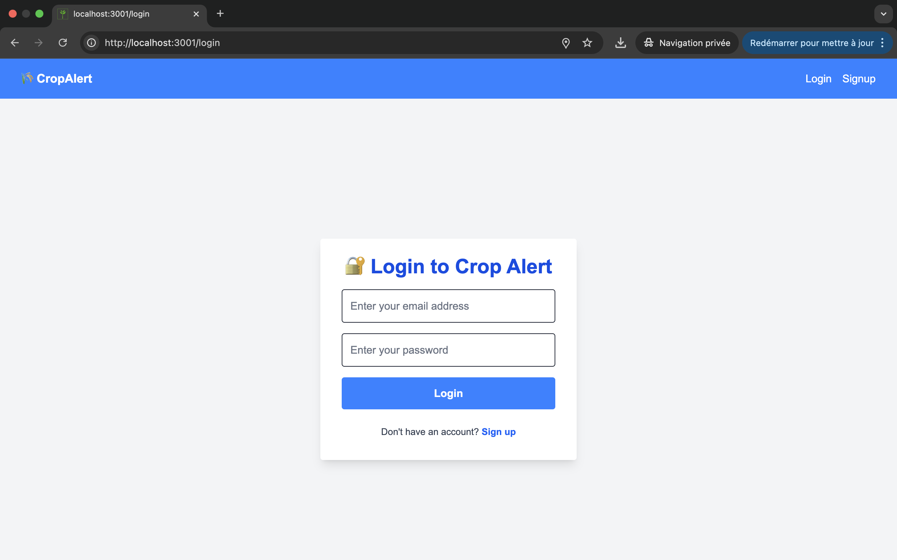
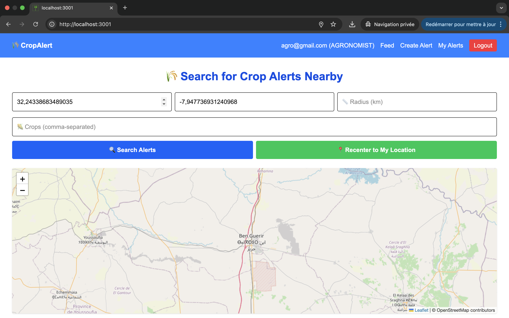
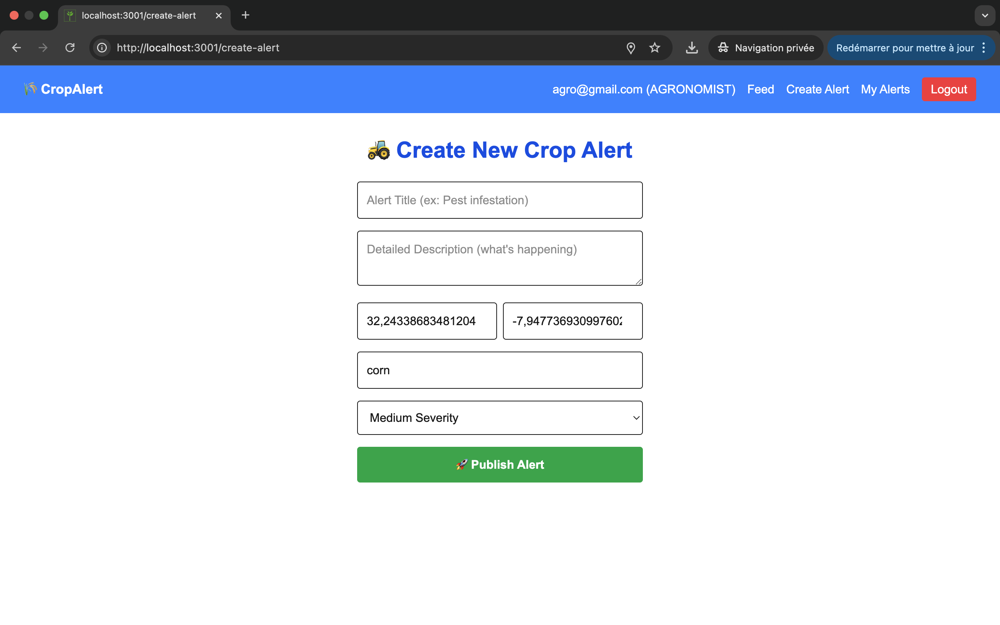

# CropAlert

CropAlert is a collaborative platform designed to connect agronomists and farmers, enabling agronomists to publish geolocalized agricultural alerts and farmers to receive real-time notifications tailored to their location and crops. This project was developed as part of an internship application technical test, meeting the requirements for a Minimum Viable Product (MVP) with a focus on real-time notifications, geolocation, and a mobile-friendly user experience.

## Table of Contents
- [Features](#features)
- [Tech Stack](#tech-stack)
- [Architecture](#architecture)
- [Installation](#installation)
- [Usage](#usage)
- [Demo](#demo)
- [Screenshots](#screenshots)
- [Evaluation Criteria](#evaluation-criteria)
- [Contributing](#contributing)
- [License](#license)

## Features
- **User Authentication**: Supports two roles (Agronomist and Farmer) with JWT-based authentication, including signup, signin, and refresh token mechanisms.
- **Alert Creation**: Agronomists can create geolocalized alerts with details such as title, description, crops, severity, and coordinates.
- **Real-Time Notifications**: Uses WebSocket (Socket.IO) to broadcast new alerts to users within a specified radius.
- **Interactive Map**: Displays alerts on a Leaflet-based map, with dynamic centering and filtering by location and crops.
- **Feed Filtering**: Farmers can filter alerts by geolocation (latitude, longitude, radius) and specific crops.
- **Mobile-Friendly UX**: Responsive design with Tailwind CSS, optimized for mobile devices.
- **Security**: Includes JWT authentication, role-based access control, input validation, and secure password hashing with Argon2.
- **Caching**: Implements Redis for caching nearby alert queries to improve performance.

## Tech Stack
### Backend
- **NestJS**: Framework for building scalable server-side applications.
- **Prisma**: ORM for PostgreSQL database management with PostGIS for geolocation.
- **Redis**: Used for caching and managing cache invalidation.
- **Socket.IO**: Enables real-time WebSocket communication.
- **JWT**: For secure authentication and authorization.
- **Argon2**: For password hashing.
- **Docker**: Containerization for PostgreSQL, Redis, and the backend application.

### Frontend
- **Next.js**: React framework for server-side rendering and static site generation.
- **React-Leaflet**: For rendering interactive maps.
- **Tailwind CSS**: For responsive and modern UI styling.
- **React Query**: For managing server-state and API calls.
- **Socket.IO Client**: For receiving real-time alerts.
- **Axios**: For HTTP requests with token refresh handling.

### Database
- **PostgreSQL with PostGIS**: For storing user data and geolocalized alerts.

## Architecture
The application follows a microservices-inspired modular architecture:
- **Backend**: A NestJS application with modules for authentication, user management, alerts, and WebSocket communication. Prisma integrates with PostgreSQL/PostGIS for spatial queries, and Redis handles caching.
- **Frontend**: A Next.js application with client-side rendering for dynamic pages, using React Query for data fetching and Socket.IO for real-time updates.
- **Real-Time**: Socket.IO enables agronomists' alerts to be broadcast to farmers within a specified geolocation radius.
- **Geolocation**: PostGIS powers spatial queries for finding nearby alerts, and Leaflet renders them on an interactive map.
- **Deployment**: Docker Compose orchestrates PostgreSQL, Redis, backend, and frontend containers.

## Installation
### Prerequisites
- Docker and Docker Compose
- Node.js (v20 or higher)
- Yarn (v4.9.1)
- Git

### Steps
1. **Clone the Repository**
   ```bash
   git clone https://github.com/Eikra/crop-alert-geolocation.git
   cd cropalert
   ```

2. **Set Up Environment Variables**
   - Copy the `.env.example` file in `nestjs-api` to `.env` and update values as needed (e.g., `DATABASE_URL`, `JWT_SECRET`).
   - Ensure the `.env.docker` file is configured for Docker Compose.

3. **Start Services**
   ```bash
   make all
   ```
   This command builds and starts the PostgreSQL, Redis, backend, and frontend containers using Docker Compose.

4. **Run Prisma Migrations**
   ```bash
   make migrate
   ```
   This generates the Prisma client and applies database migrations.

5. **Access the Application**
   - Backend: `http://localhost:3000`
   - Frontend: `http://localhost:3001`

## Usage
1. **Sign Up**: Create an account as either an Agronomist or Farmer.
2. **Sign In**: Log in to access the dashboard.
3. **Create Alerts (Agronomists)**: Navigate to the "Create Alert" page to publish a new alert with geolocation and crop details.
4. **View Alerts (Farmers)**: Use the feed page to filter alerts by location and crops, and view them on the interactive map.
5. **Real-Time Updates**: New alerts are automatically displayed via WebSocket notifications.
6. **Manage Alerts (Agronomists)**: Edit or delete your alerts from the "My Alerts" page.

## Demo
- **Live Demo**: (in progress)
- **Video Tutorial**: (in progress)

## Screenshots
- **Login Page**:
  
- **Feed Page with Map**:
  
- **Create Alert Page**:
  

*(Note: Replace `screenshots/` with actual paths if you include images in the repo.)*

## Evaluation Criteria
The project was designed to meet the technical test's evaluation criteria:
- **Real-Time Architecture (30%)**: Implemented with Socket.IO for broadcasting alerts to users in specific geolocation rooms.
- **Geolocation (20%)**: Uses PostGIS for spatial queries and Leaflet for map visualization, with geolocation-based filtering.
- **Collaborative UX (20%)**: Responsive, intuitive UI with role-based navigation and mobile optimization.
- **Data Modeling (15%)**: Prisma schema with `User` and `Alert` models, including enums for roles and severity, and PostGIS for geospatial data.
- **Security (10%)**: JWT authentication, role-based guards, input validation, and Argon2 password hashing.
- **Innovation (5%)**: Redis caching for performance, WebSocket room-based notifications, and a clean, modular architecture.

## Contributing
Contributions are welcome! Please follow these steps:
1. Fork the repository.
2. Create a new branch (`git checkout -b feature/your-feature`).
3. Commit your changes (`git commit -m 'Add your feature'`).
4. Push to the branch (`git push origin feature/your-feature`).
5. Open a Pull Request.

## License
This project is licensed under the MIT License. See the [LICENSE](LICENSE) file for details.